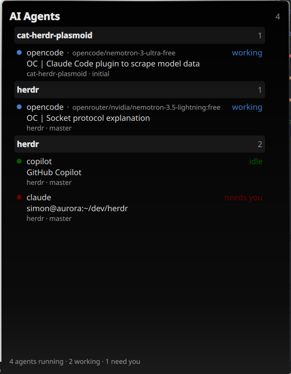
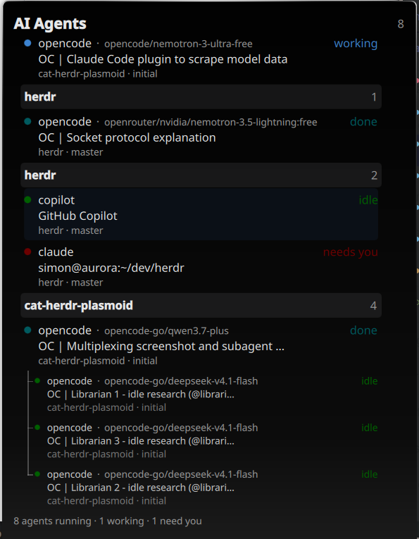

# Cat Herdr

<p align="center">
  
</p>

<p align="center">Herding AI coding agents is like herding cats. This is the shepherd's crook.</p>

A KDE Plasma 6 widget that watches [Herdr](https://github.com/herdrdev/herdr)-managed AI coding agents. See who is working, blocked, idle, or waiting for you without switching between terminals.

## What it looks like





## Prerequisites

- KDE Plasma 6 development/runtime tooling, including `kpackagetool6` for installation and `plasmoidviewer` for source-tree development.
- `herdr` on `PATH`. The installer resolves its absolute path so plasmashell does not need to inherit your shell's `PATH`.
- Node.js for the model-reporter hooks and the Node test suite.
- `jq` for the optional agent plugin install/uninstall helpers.
- PySide6 only for the optional QML integration test (`python3 tests/runtime.py`).

## Installation

Install the plasmoid as your desktop user, then restart plasmashell:

```bash
./install.sh
systemctl --user restart plasma-plasmashell.service
```

The main installer installs only the plasmoid; model reporters are optional and are not installed automatically.

### Optional agent plugins

Run these from the repository root, as the user who runs the corresponding agent:

| Agent | Install | Uninstall |
|---|---|---|
| Claude Code | `./plugins/claude/install.sh` | `./plugins/claude/uninstall.sh` |
| Cursor Agent | `./plugins/cursor/install.sh` | `./plugins/cursor/uninstall.sh` |
| GitHub Copilot CLI | `./plugins/copilot/install.sh` | `./plugins/copilot/uninstall.sh` |
| OpenCode | `./plugins/opencode/install.sh` | `./plugins/opencode/uninstall.sh` |

These helpers install user-global hooks/plugins. They only report metadata when the agent is running in a Herdr-managed pane. Restart the agent after changing its plugin configuration.

For OpenCode, `./plugins/opencode/install.sh` and `./plugins/opencode/uninstall.sh` automatically edit `~/.config/opencode/tui.jsonc` only when it is comment-free JSON. If the existing `tui.jsonc` contains comments, the command fails safely without changing it and prints the manual JSONC-aware editing procedure; copy the plugin and add/remove its entry manually as instructed.

## Uninstallation

Remove the plasmoid and restart plasmashell:

```bash
./uninstall.sh
systemctl --user restart plasma-plasmashell.service
```

Optional agent plugins must be removed separately with the commands in the table above.

## Development

`package/contents/config/main.xml` contains the install-time `@HERDR_BIN@` placeholder. Do not point `plasmoidviewer` directly at the source tree: the literal placeholder is not an executable. Use this safe, runnable route instead; it copies the package to a temporary directory and leaves the checkout unchanged:

```bash
herdr_bin=$(command -v herdr) || { echo "herdr not found on PATH" >&2; exit 1; }
tmp=$(mktemp -d)
trap 'rm -rf "$tmp"' EXIT
cp -a package/. "$tmp/"
escaped=$(printf '%s' "$herdr_bin" | sed 's/[\\&|]/\\&/g')
sed -i "s|@HERDR_BIN@|$escaped|g" "$tmp/contents/config/main.xml"
plasmoidviewer -a "$tmp"
```

Run the current Node unit suite with:

```bash
npm --prefix tests test
```

The PySide6 runtime suite is separate:

```bash
python3 tests/runtime.py
```

## License

MIT
